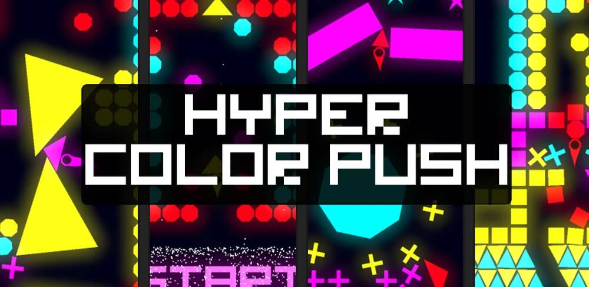

# Hyper Color Push



Hyper Color Push is a 2D Hyper-Casual Retro Arcade Game for iOS and Android, developed with Unity3D. This repository contains the full source code and assets for the game. It's also my first published title on Android and iOS App Stores.

### [Check out the promo video on YouTube!](https://youtu.be/fSkaO2LAT-4?si=MBP_mnthEmwVAw43)

## Features

- Exciting and addictive gameplay.
- Original retro-inspired graphics.
- Original music created by James Hartley and Jesus Robles.
- Integration with Facebook SDK for Analytics.
- Integration with Unity Ads.

## Getting Started

Follow these steps to get started with the game:

1. Clone this repository to your local machine.
   ```shell
   git clone https://github.com/yourusername/hyper_color_push.git
2. Open the project using Unity 2018
3. Build for your device
